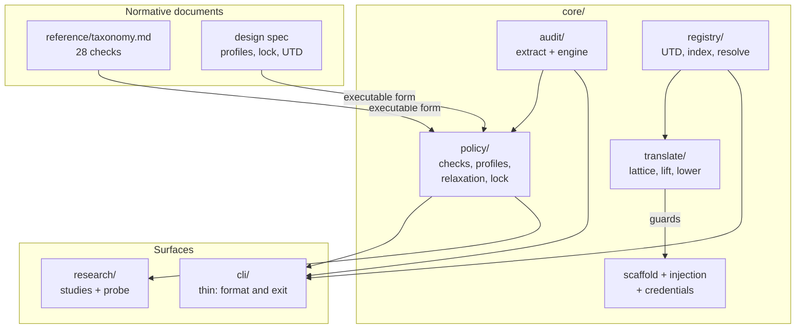
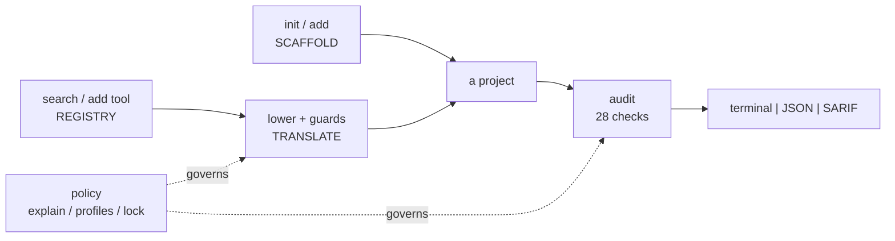
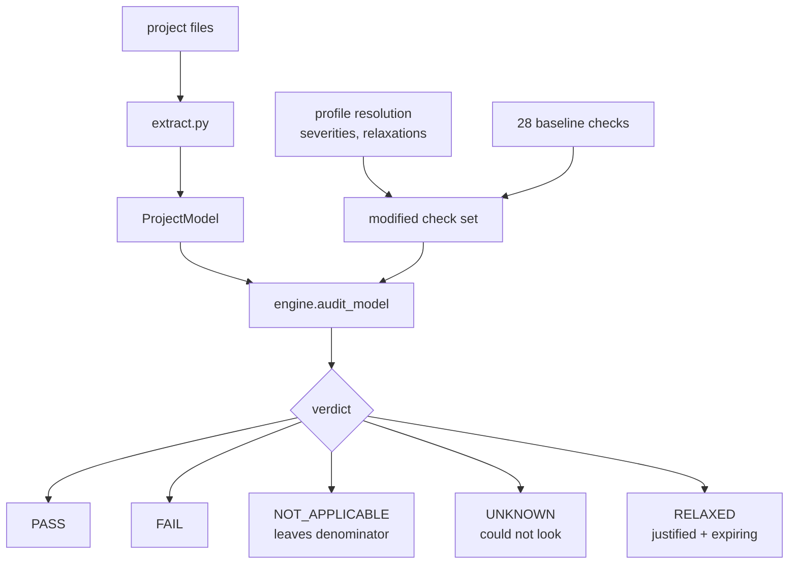
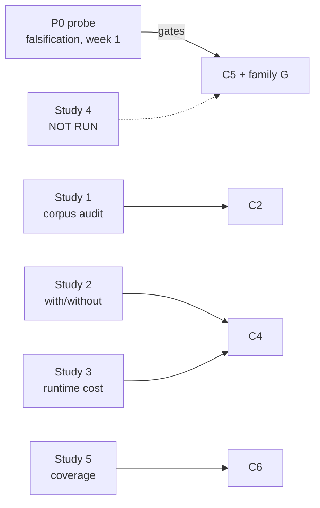

# Reviewing toolseal

A guide for reading this repository from the start, and a status report on the
research components. Written for review before pushing 28 local commits.

**State at time of writing:** 881 tests passing, 5 skipped (the skips need a
running Ollama). `ruff`, `ruff format` and `mypy --strict` clean.
`toolseal audit .` scores 100/100 on itself, no findings.

---

## 1. How to review, in order

The repository has a spine. Reading it in dependency order costs far less than
opening files alphabetically, because almost everything downstream is an
executable restatement of two documents.

### Step 0 — verify the claims before reading the code

```bash
uv run ruff check . && uv run ruff format --check . && uv run mypy && uv run pytest
uv run toolseal audit .          # the tool, on itself: expect 100/100
```

If those disagree with the paragraph above, stop and start there.

### Step 1 — the two normative documents

Everything else implements these. Read them first or the code will look arbitrary.

| Read | Why it comes first |
| --- | --- |
| `reference/taxonomy.md` | The 28 checks. Normative — the paper cites it. Note its "Rules for changing this document": ids are permanent, a rewritten check records the rewrite, severity changes need a stated reason. |
| `docs/superpowers/specs/2026-08-13-standards-compliance-policy-design.md` | The standards/compliance/policy design. §5 profiles, §6 relaxation, §8 the lock, §9 the UTD compliance block. |

`docs/` is gitignored, so the spec is local-only. That is worth a decision: the
paper cites it, and it currently exists on one machine.

### Step 2 — the policy core

This is where the research contribution lives. Read in this order:

```
core/policy/model.py       Check, Verdict, Finding, AuditReport, scoring
core/policy/controls.py    control catalogues (the standards mapping)
core/policy/coverage.py    the checks x controls matrix
core/policy/profile.py     the overlay engine (P44)
core/policy/relax.py       justified, expiring deviations (P44)
core/policy/lock.py        seal / verify (P48)
core/policy/family_*.py    the 28 checks themselves
```

**Three scoring decisions carry the argument.** Verify each survived:

- `Verdict.UNKNOWN` is distinct from `PASS`. "We did not look" must never be
  reported as "we looked and it was fine."
- Inapplicable checks leave the denominator. A project with no remote endpoint
  is not penalised for family D.
- `blocking` is reported *apart* from the score, because a severity-weighted
  average can hide one critical finding behind a long tail of passes.
  `relaxed_critical` was added alongside it for the same reason.

### Step 3 — the rest of the engine

```
core/audit/extract.py      files -> ProjectModel  (the trust boundary)
core/audit/engine.py       runs checks; a raising check becomes UNKNOWN, not silence
core/registry/utd.py       the Unified Tool Descriptor + compliance block
core/translate/lattice.py  what each abstraction can express
core/translate/lower.py    guard synthesis - contribution C5
core/injection.py          hash-verified managed files, reversible
```

### Step 4 — the surface

`cli/` is deliberately thin: it formats and exits. If you find computation
there, that is a finding.

### Step 5 — the evidence

```
research/evaluation-protocol.md
research/probes/p0_translation_fidelity/     the falsification probe
research/studies/s1|s2|s3|s5/RESULTS.md
```

### Step 6 — read the tests as specification

Three carry unusual weight:

| Test | What it pins |
| --- | --- |
| `tests/test_executable_guards.py` | Guards are **executed**, not read. A generated binding that imports something undefined looks fine until run. |
| `tests/test_control_mapping.py` | Row-level drift guard: `reference/taxonomy.md` and the code must agree in **both** directions. Proven able to fail against misattribution, stale rows and fabrication. |
| `tests/test_gate_vertical_slice.py` | End-to-end: scaffold produces a project that scores clean. |

---

## 2. What the repository is



### The three pillars, and what cuts across them



`init`/`add` **always** emit the secure configuration — there is no insecure
path to opt into. `audit` is advisory: findings, scores, never a block. That
asymmetry is deliberate and load-bearing for the DX claim.

### How a check reaches a verdict



The engine never learns that profiles exist. Resolution happens above it and
hands it a modified check set. That boundary is asserted by test.

---

## 3. Paper components: status and inference

### Contributions

| | Contribution | Status | Evidence |
| --- | --- | --- | --- |
| **C1** | Taxonomy of agent **configuration** misconfigurations | **Done** | `reference/taxonomy.md`, 28 checks, 7 families, every check citing an external control |
| **C2** | First measurement of setup-guidance security posture | **Partial — negative** | Study 1 ran; 0 of 12 completions materialised |
| **C3** | toolseal itself: scaffolder, registry, auditor | **Done** | 881 tests; self-audit 100/100 |
| **C4** | Secure defaults are free in DX and runtime | **Done** | Studies 2 and 3 |
| **C5** | Expressiveness lattice + compensating guards | **Done (mechanism)** | Probe P0, `translate/`, executable guard tests. Study 4 not run |
| **C6** | Control mapping from taxonomy to published standards | **Done** | Study 5 |

### What each result actually says

**Study 2 — the DX claim, and it is strong.**
Manual mean audit score **8.0**; toolseal **100.0**. Manual **10 steps**;
toolseal **2**. Four of six manual projects carry a critical finding.

*Inference:* secure defaults cost nothing in setup effort — they cost less. The
manual arm is an **idealised** quickstart (no typos, no debugging), so it is a
**lower bound** on manual effort, which makes the advantage a conservative
estimate. The two adverse tasks are refusals, which is the correct behaviour
and is reported rather than hidden.

**Study 3 — the runtime claim, and it needs careful wording.**
A compensating guard costs **0.85 µs** per call. AgentWarden reports ~800 ms
per call for runtime capability governance.

*Inference:* properties knowable at configuration time do not need re-deriving
on every call. The ~888,000× ratio is **indicative, not like-for-like** —
AgentWarden's 800 ms buys a learned, task-aware policy; a guard reinstates one
declared property. The results file says so itself, and two tests exist to stop
the bare ratio being quoted. **Keep that discipline in the paper.**

**Study 1 — an honest negative.**
12 completions from `qwen2.5:3b`, **0 materialised** into auditable projects.

*Inference:* this is an instruction-following result, not a security result. A
3B open-weight model could not produce a runnable project from a setup prompt.
It bounds what C2 can claim to nearly nothing at present. Reported rather than
dropped, because discarding failures would bias the sample toward tidy answers.

**Study 5 — coverage, with the denominator kept honest.**

| standard | coverage | note |
| --- | --- | --- |
| `owasp-llm-top10` | 5/5 = 100% | complete enumeration |
| `owasp-agentic-top10` | 5/5 = 100% | complete enumeration |
| `owasp-agentic-threats` | 6/6 = 100% | complete enumeration |
| `nist-ai-rmf` | 4/5 = 80% | **curated subset** (~7 of 70) |
| `iso-42001` | 1/3 = 33% | **curated subset** (~4 of 36) |

0 of 28 checks unmapped. Uncovered and named: `A.6.2.2`, `A.6.2.4`, `MANAGE-2.2`.

*Inference:* the three complete enumerations measure real reach. The two marked
subsets measure **which controls were shortlisted**, not the taxonomy's reach —
their files were drawn up before any mapping existed. `complete_enumeration` is
a field on the data, not a footnote, so the distinction travels into any table.
Coverage also counts *citations*, not adequacy. Both caveats are printed by
`toolseal policy list` and stated in the study.

### Still to do for the paper

| Item | Blocks | Note |
| --- | --- | --- |
| **Study 4** — translation fidelity at scale | C5's empirical half | Richer now: 5 abstractions, 3 `MEASURED` rows, working lift/lower |
| **Study 1 re-run** | C2 | Needs a model that can follow setup instructions. Current result bounds C2 to almost nothing |
| **P38** coordinated disclosure | Study 1 on third-party repos | Must exist **before** auditing others' code, not after |
| **P37 / P41** write-up, then reconcile every claim against measured evidence | — | P41 is the step that catches overclaims |
| **Externally review the mapping** | C1, C6 | The drift guard proves document and code agree; nothing proves either is *right* |
| **HIPAA URL** verified by indexing, not fetch | C6 | Weaker than the EUR-Lex citations; disclosed |

---

## 4. Methodology: what is done and how

### The evaluation spine



### How each was done

**P0 — falsification first.** Before building anything that depended on it, the
hypothesis "adapters drop MCP security metadata" was tested. It came back
**half-false**: `langchain-mcp-adapters` preserves all 15 annotation
properties; `crewai-tools` drops all 15. The claim was reframed to
*loss is adapter-dependent, not inherent* — a sharper claim, and the reason
compensating guards are possible at all.

**Study 2 — scripted, not human.** An idealised manual baseline is generated
from what the official quickstarts actually instruct, then both arms are
audited by the same engine. No human arm (deliberately dropped). The idealised
baseline is the methodological choice that makes the result conservative.

**Study 3 — median, not mean.** An early version reported a mean, and a single
scheduler hiccup dragged it past 1 ms against a ~14 µs signal. Switched to
median with p95 reported alongside. Provider latency is excluded deliberately:
a model round trip would hide a microsecond-scale difference and produce a
meaningless null.

**Study 5 — generated, not typed.** Every number comes from
`uv run python -m bench s5`, so the study regenerates when the mapping changes.

### Methodological habits worth preserving

These are why the numbers can be trusted, and each was earned by fixing a
specific failure:

1. **Falsify before building.** P0 ran in week 1 and gated C5.
2. **Execute, do not read.** Guards are run, not inspected — a generated
   binding that imports something undefined looks fine on the page.
3. **Report the negative.** Study 1's zero is published as a result.
4. **Keep the denominator honest.** `complete_enumeration`, inapplicable checks
   leaving the denominator, `UNKNOWN` distinct from `PASS`.
5. **Make the caveat structural.** A field on the data, not a sentence in a
   docstring, because only the field survives being copied into a table.
6. **Prove the guard can fail.** The drift guard was rebuilt row-level and
   verified against misattribution, stale rows and fabrication.

### What is left, and how it should be done

| Left | Method it should follow |
| --- | --- |
| **Study 4** | Same shape as P0, widened: round-trip annotated MCP tools through every adapter, report loss per property per adapter, then verify guards restore behaviour **by executing them** |
| **Study 1 re-run** | Unchanged protocol; swap the model. Keep exclusions counted, not dropped |
| **Severity drift guard** | Extend `test_control_mapping.py` to compare severities as well as controls. Severities feed the weighted score the evaluation compares across versions |
| **P16 registry seeding** | Curation criteria fixed **in writing before** seeding — the plan's own mitigation against curating and then auditing our own entries |
| **P40 demo rehearsal** | Twice, on genuinely fresh machines, recorded as fallback |

---

## 5. Known open items

| Item | Kind | Where |
| --- | --- | --- |
| `MANAGE-2.2` uncovered | Real mapping gap | Study 5 names it |
| `B4` extended rather than adding `B6` | Judgment call | P46; preserved the 28-check invariant |
| `data_classes` has no automatic producer | Deliberate | Deriving it from hostnames would be the heuristic inference the spec forbids |
| Severity drift unguarded | TODO | Controls guarded both directions; severities are not |
| `docs/` is gitignored | Decision needed | The paper cites specs that exist on one machine only |
| Study 1 corpus | Blocks C2 | 0 of 12 materialised |

---

## 6. Fast path if you only have an hour

1. `uv run pytest` and `uv run toolseal audit .` — check the claims hold.
2. `reference/taxonomy.md` — the whole argument in one file.
3. `core/policy/model.py` — scoring semantics; the three decisions in §1 Step 2.
4. `tests/test_executable_guards.py` and `tests/test_control_mapping.py` — the
   two tests that keep the rest honest.
5. `research/studies/s2/RESULTS.md` and `s3/RESULTS.md` — the headline numbers.
6. `git log --oneline origin/main..HEAD` — the 28 commits awaiting push.
